# Manga Generator | Nano Banana Edition

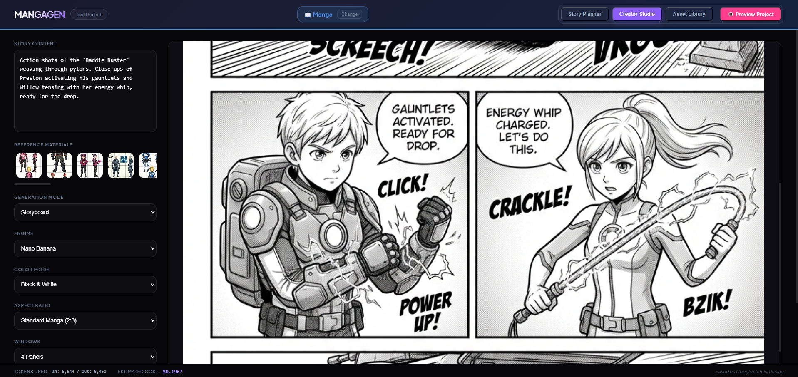

A professional-grade, AI-powered workspace for creating manga, comics, and illustrated storybooks. Leveraging Google Gemini's advanced multimodal capabilities, this application transforms raw text into fully realized visual narratives with precise control over layout, style, and composition.

## 🚀 Application Workflow

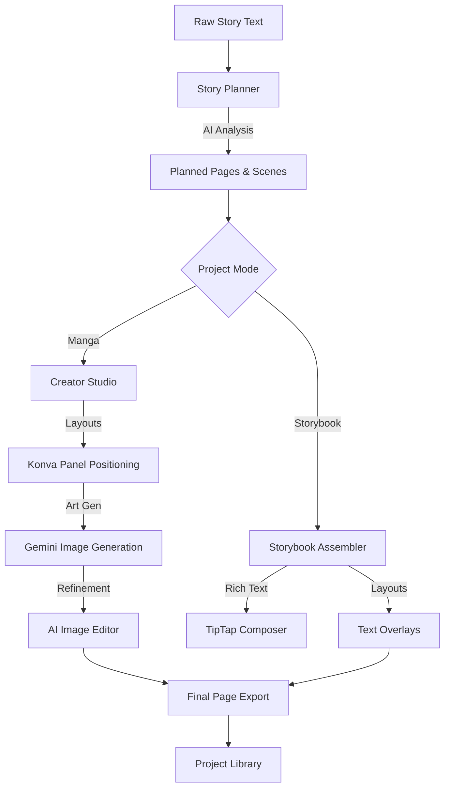

---

## ⚡ Quick Start

### 1. Prerequisites
- **Node.js** (v18+ recommended)
- **Google Gemini API Key**: Obtain from [Google AI Studio](https://aistudio.google.com/).

### 2. Installation
```bash
# Clone the repository and install dependencies
npm install
```

### 3. Configuration
Create a `.env` file in the root directory (copy from `.env.example` if available):
```env
GOOGLE_API_KEY=your_api_key_here
PORT=3001

# Optional: Override default models
# CREATOR_FLASH_MODEL=gemini-3-flash-preview
# CREATOR_PRO_MODEL=gemini-3-pro-preview
# CREATOR_IMAGE_MODEL_FLASH=gemini-2.5-flash-image
# CREATOR_IMAGE_MODEL_PRO=gemini-3-pro-image-preview
```

### 4. Run the Application
Start both the backend server and the frontend development environment in a single command:
```bash
npm run launch
```
The app will be available at [http://localhost:5173](http://localhost:5173).

---

## 🎨 Core Features

### 📖 Dual Mode Support
- **Manga Mode**: Focuses on panel-based layouts, dynamic dialogue bubbles (coming soon), and action-oriented composition.
- **Storybook Mode**: Optimized for full-page illustrations with elegant text overlays, perfect for children's books or visual novels.

<div align="center">
  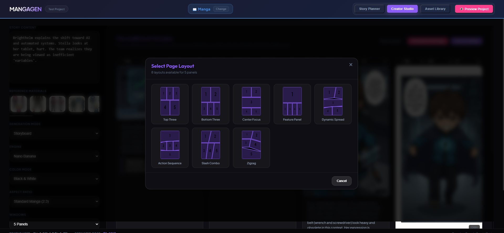
  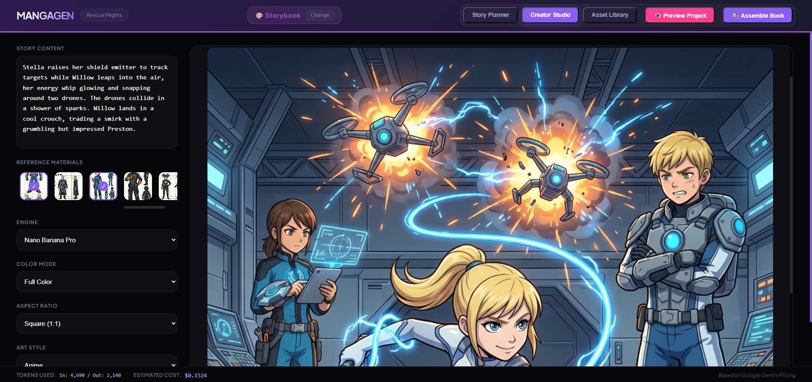
</div>

### 📝 Story Planner
- **AI Decomposition**: Automatically breaks long story scripts into logical page segments.
- **Visual Anchors**: Extracts exact verbatim text for captions and dialogue.
- **Batch Generation**: Queue up an entire project and let the AI generate blueprints for every page.
- **Style Persistence**: Define a global art style to maintain consistency across the entire book.


### 🎭 Creator Studio (Manga Mode)
- **70+ Dynamic Layouts**: Choose from a vast library of panel configurations, from simple grids to complex diagonal action splits.
- **Live Layout Preview**: Drag, scale, and reposition panels in real-time using a **Konva-based** WYSIWYG editor.
- **Panel-Level Control**: Assign specific art styles, aspect ratios, and AI engines to individual panels.
- **Gutter Customization**: Adjust spacing and colors between panels for the perfect aesthetic.

<div align="center">
  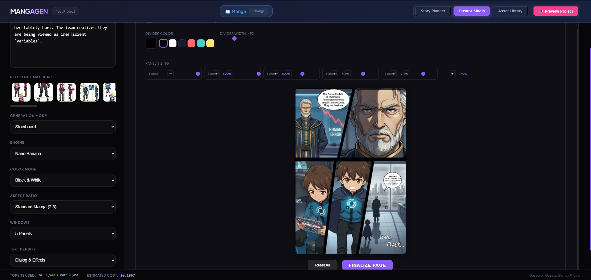
  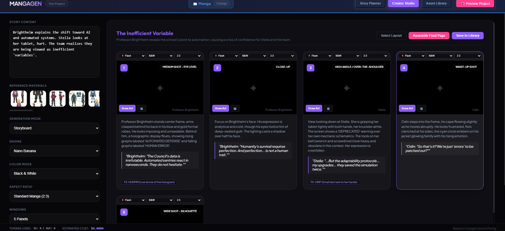
</div>

### ✍️ Storybook Assembler (Storybook Mode)
- **TipTap Integration**: Full rich text editing (Bold, Italic, Colors, Lists) for page content.
- **Responsive Overlays**: 5+ layout presets for text placement (Top, Bottom, Sidebars, Floating).
- **Typography Engine**: Fine-grained control over font family, size, line height, and letter spacing.
- **Export Options**: Download individual pages as high-res PNGs or export the entire project as a professional PDF.

<div align="center">
  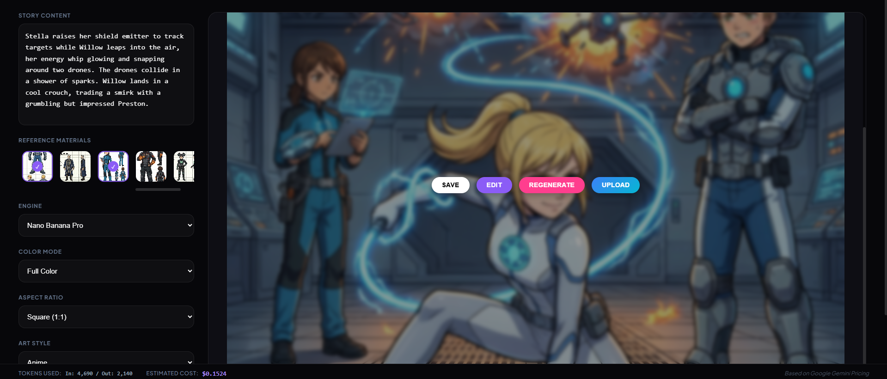
  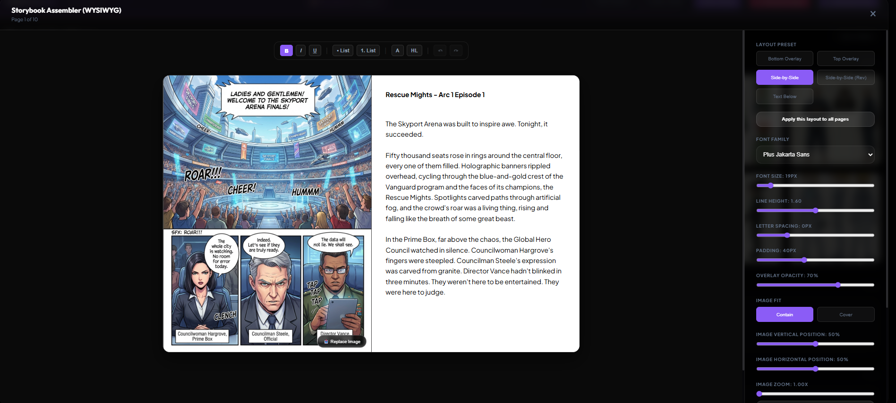
</div>

### 🖌️ AI Image Editor
- **Brush-Based Editing**: Highlight specific areas of an image and tell the AI what to change (In-painting).
- **Character Insertion**: Select characters from your library and "drop" them into an existing scene with AI assistance.
- **Dimension Matching**: Edits preserve the original image resolution and aspect ratio seamlessly.

<div align="center">
  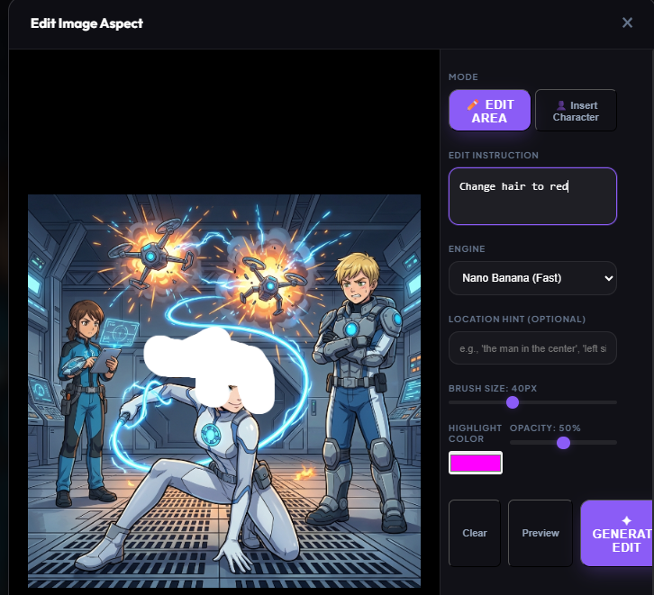
  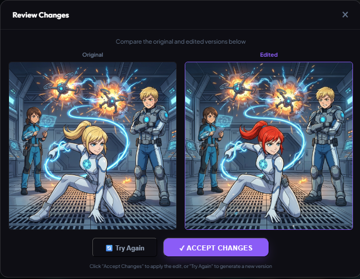
</div>

### 📂 Asset Library & References
- **Global & Project Libraries**: Manage characters, locations, and style references.
- **Visual Prompting**: Assets selected in the library are automatically passed to the AI as visual references to maintain character and environment consistency.

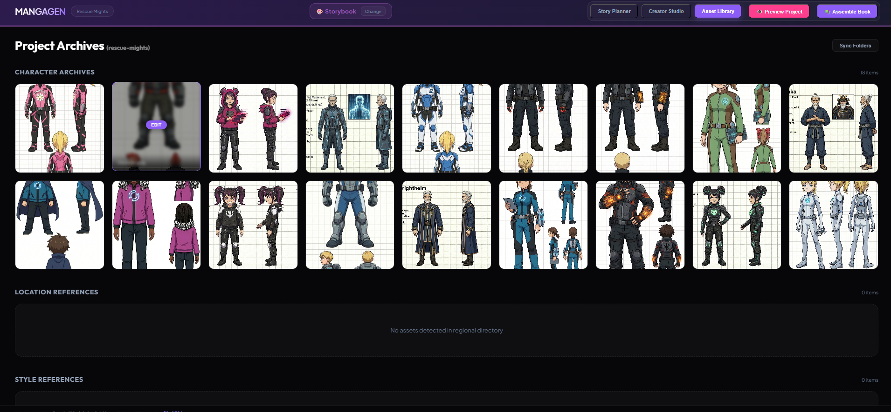

---

## 🤖 AI Engine & Cost Tracking
- **Gemini Flash & Pro**: Seamlessly toggle between "Flash" for rapid iteration and "Pro" for final high-fidelity artwork.
- **Real-Time Usage Metrics**: Monitor token consumption (Input/Output) for every generation.
- **Cost Estimation**: Built-in pricing calculator to track your API spending in real-time.

---

## 📁 Project Structure
- `projects/`: Contains individual project folders, metadata (`project.json`), and generated assets.
- `characters/`, `locations/`, `style/`: Global library for reusable assets.
- `server.js`: Node.js/Express backend managing file system operations and Gemini API proxying.
- `src/`: React frontend containing the specialized views and components.

---

## 🛠️ Tech Stack
- **Frontend**: React 19, Vite, Tailwind CSS (for layout)
- **Canvas**: Konva / react-konva for complex image manipulation
- **Text Editing**: TipTap / ProseMirror
- **Backend**: Node.js, Express
- **AI**: Google Generative AI (@google/generative-ai)
- **Export**: html2canvas, jspdf

---

## 💡 Pro Tips
- Use **Character Sheets** in your library for best consistency.
- In the **Planner**, use "Full" text density if you want the AI to handle all dialogue and FX.
- The **Konva Preview** renders at exactly 800x1200 for standard manga proportions.

---

Developed with ❤️ for Manga Creators.

---

## 🖼️ Final Examples

| Cover Art | Page 1 | Page 2 |
| :---: | :---: | :---: |
|  |  |  |
