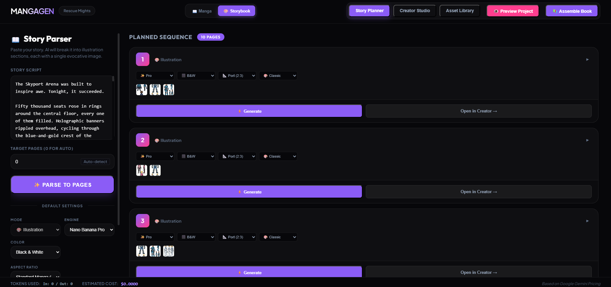
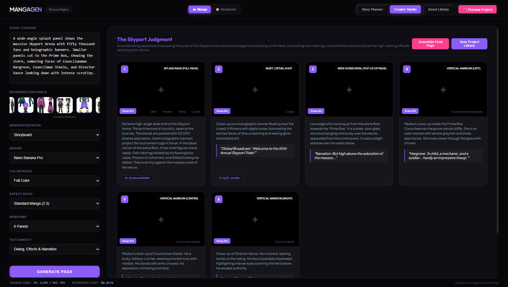
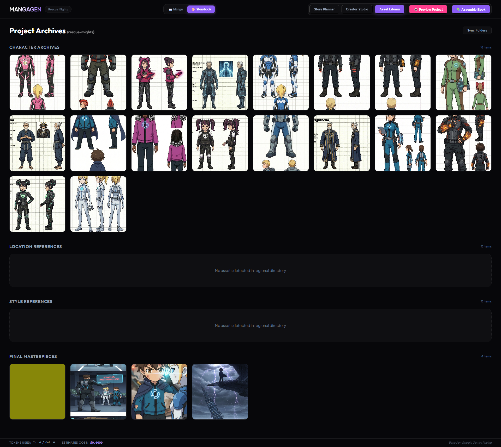
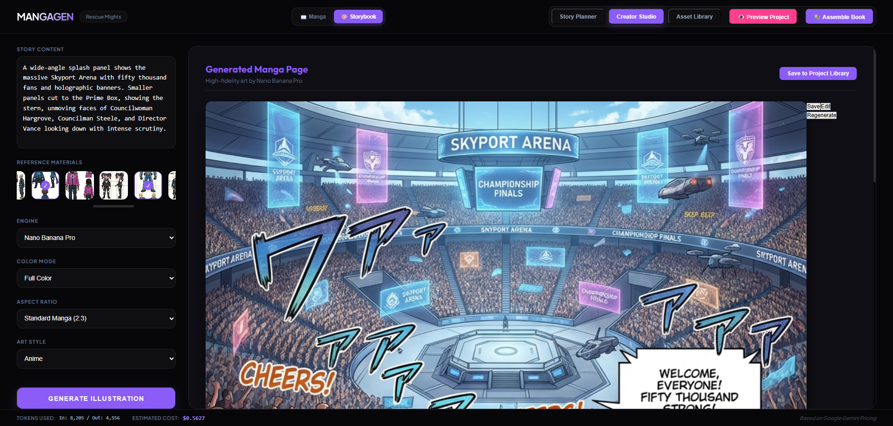
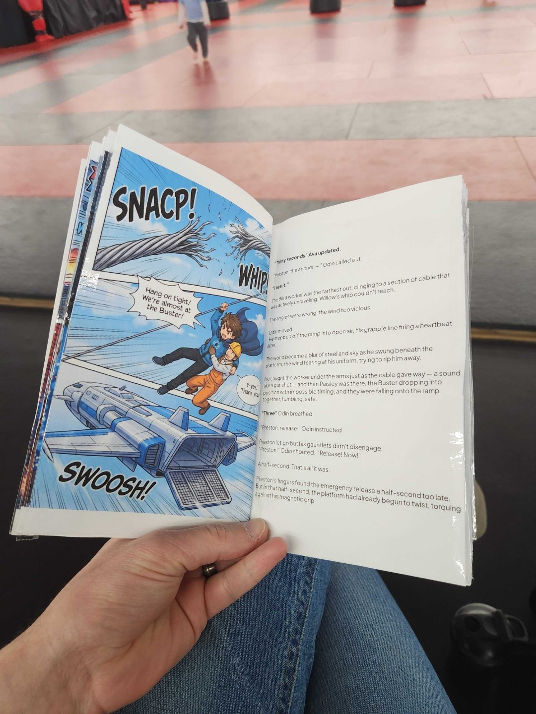

# Manga Generator | Nano Banana Edition

A powerful, single-page application for generating manga panels using Google's Nano Banana and Nano Banana Pro.. This tool bridges the gap between text stories and visual manga pages, offering a complete workflow from script parsing to final image generation.


## Quick Start

1.  **Install Dependencies**:
    ```bash
    npm install
    ```

2.  **Configure API Key**:
    -   Rename `.env.example` to `.env`.
    -   Add your Google Gemini API Key.

3.  **Run the Application**:
    ```bash
    npm start
    ```
    This will start the local backend server.

4.  **Run the Frontend (Dev)**:
    In a separate terminal:
    ```bash
    npm run dev
    ```
    Open [http://localhost:5173](http://localhost:5173).

---

## Current Features

### 1. Story Planning & Parsing
Quickest way is to start by pasting your raw story text into the **Story Parser**. The AI analyzes your text and breaks it down into structured manga pages and panels.


### 2. Storyboard Editing
You may also use the creator studio to edit a single manga page's layout, visualize your page in the **Storyboard**. Here you can:
-   Rearrange panels.
-   Edit dialogue and descriptions.
-   Assign specific character references to panels.


You also can generate the full page in one shot based on the prompt.

### 3. Asset Management
Manage your visual consistency using the **Asset Library**. Upload and organize:
-   **Characters**: Character sheets and reference poses.
-   **Locations**: Backgrounds and setting references.
-   **Styles**: Style reference images to guide the aesthetic.


### 4. Creation Studio
Generate your final high-resolution pages in the **Creator Studio**.
-   **Modes**: Switch between *Storyboard Mode* (fast layouting) and *Full Page Generation*.
-   **Engines**: Choose between **Nano Banana** (Speed/Cost) and **Nano Banana Pro** (Quality).


---

## Output Examples

There is a layout editor for your final pdf export. Basic but will be improved upon later.

| Page Example 1 | Page Example 2 |
| :---: | :---: |
|  |  |

---

## Folder Structure

-   `characters/`: Character sheets and reference images.
-   `locations/`: Environment and scenery images.
-   `pages/`: Your generated manga pages.
-   `projects/`: Saved project files (stories, storyboards).
-   `server.js`: Node.js server managing local files and Gemini API proxy.
